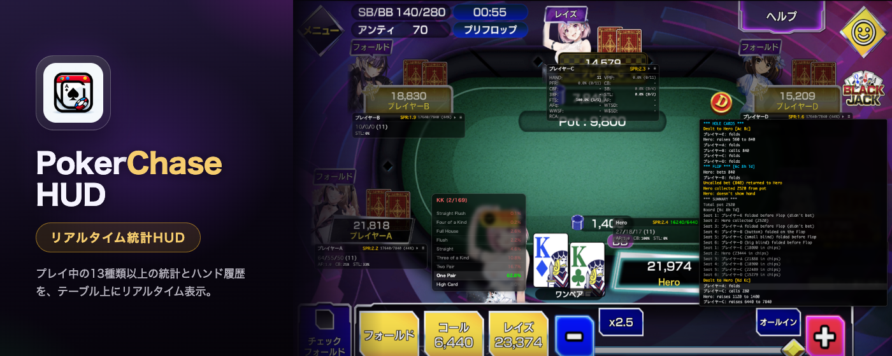
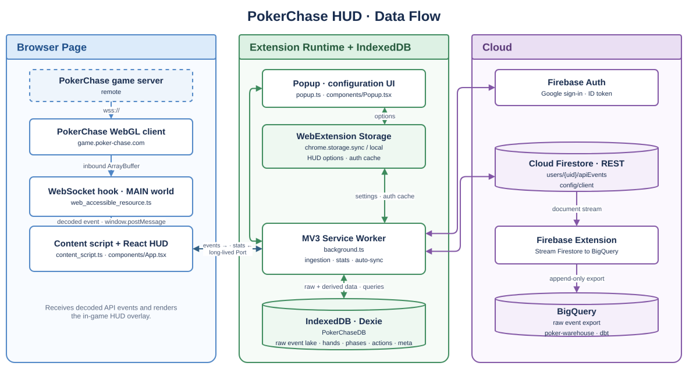

# PokerChase HUD

An unofficial Chrome extension providing real-time poker statistics and hand history tracking.



> **Note**: This codebase was primarily written by [Claude Code](https://claude.ai/code), demonstrating AI-assisted software development capabilities.

## Disclaimer

This is an **unofficial** Chrome extension not affiliated with PokerChase. Use at your own risk. The developers assume no responsibility or liability for any consequences arising from the use of this tool.

## Features

- **Real-time HUD**: Player statistics overlay with 15+ poker metrics — compact classic-style display by default (click to expand the full grid), threshold-based color coding, and per-stat tooltips
- **Player-type icons**: Automatic HM-style classification per opponent (🦈 TAG / 💣 LAG / 🪨 nit / 🐟 fish, with a 🐳 whale override)
- **Drill-down panels**: Per-player positional stats and recent hands (with showdown hole cards), straight from the HUD
- **Pre-game hero stats**: Your own career stats render before the first hand is dealt
- **Hand History**: Live PokerStars-format hand log with export
- **Flexible Filtering**: Game type, table size, and hand count filters
- **Drag & Drop UI**: Customizable HUD positioning
- **Data Export**: JSON and PokerStars formats
- **Cloud Backup**: Automatic backups with cloud sync
- **Self-updating**: Chrome-delivered updates (Web Store / managed installs) auto-apply between games, with in-popup release notes (dark/light themed popup). Unpacked (Developer-mode) installs update by re-downloading the release ZIP

## Quick Start

### Installation

#### Option 1: From Release (Recommended)

1. Download the latest `extension.zip` from [Releases](https://github.com/solavrc/pokerchase-hud/releases)
2. Extract the ZIP file
3. Open `chrome://extensions/`
4. Enable "Developer mode"
5. Click "Load unpacked" and select the extracted folder

#### Option 2: From Source

1. Build from source

```sh
git clone https://github.com/solavrc/pokerchase-hud.git
cd pokerchase-hud
npm install
npm run build
```

2. Open `chrome://extensions/`
3. Enable "Developer mode"
4. Click "Load unpacked" and select the project folder

### UI visual mockup

Run the HUD against deterministic mock data without loading the extension or
opening PokerChase:

```sh
npm run mockup
```

Open `http://127.0.0.1:4173`. The control panel switches between representative
table states, changes the HUD scale, toggles the hand log, and resets dragged
HUD positions. The mockup renders the production `Hud` and `HandLog` components,
so visual changes are shared with the extension rather than duplicated.

## Architecture



## Documentation

📖 **[Technical Documentation](CLAUDE.md)** - Complete technical reference including:

- Architecture overview and design principles
- Stream processing pipeline details
- Database schema and API reference
- Development guidelines and best practices
- Cloud sync setup and troubleshooting

## Contributing

Contributions are welcome! The codebase uses a modular architecture for easy extension.

📖 **[Contributing Guide](CONTRIBUTING.md)** - Complete guide for adding new statistics with examples and testing requirements

📁 **[Project Structure](docs/file-organization.md)** - Detailed directory layout and file organization
