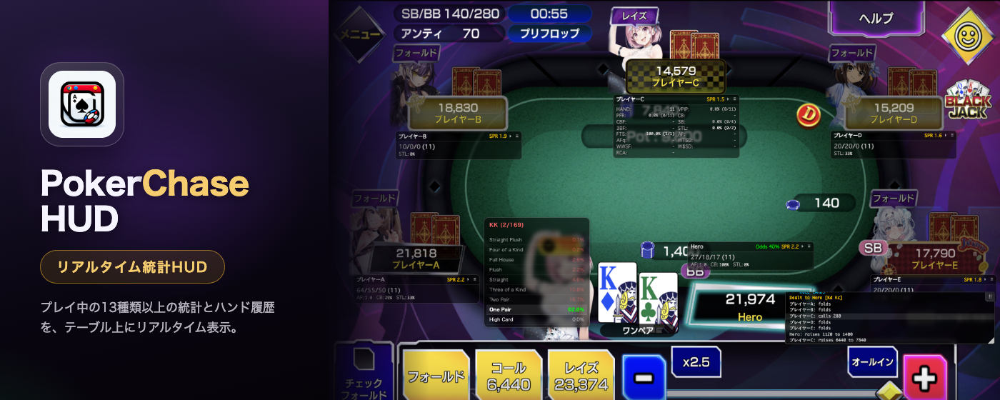
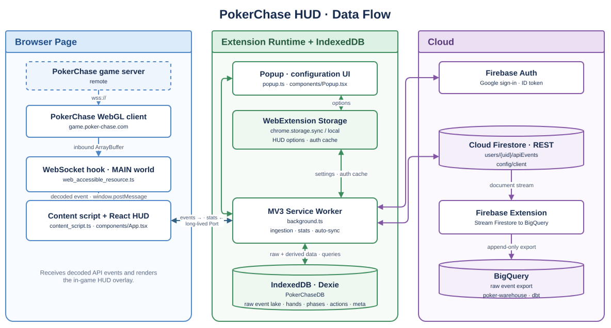

# PokerChase HUD

PokerChaseの対戦画面に、プレイヤー統計とハンド履歴をリアルタイム表示する非公式Chrome拡張機能です。



## 概要

PokerChase HUDは、ゲーム中に受信したイベントから各プレイヤーの傾向、ポットオッズ、SPRなどを計算し、Unity WebGLの対戦画面上へ重ねて表示します。ハンド履歴の記録、PokerStars形式での出力、ローカルデータのバックアップ、任意のクラウド同期にも対応しています。

## 主な機能

- **リアルタイムHUD**: 17種類のポーカー統計（初期状態では14種類）を表示します。標準のコンパクト表示から詳細グリッドへ展開でき、分母が20以上の統計では値の閾値に応じた色分けを、20未満では低信頼度を示すグレー表示を利用できます。各統計にはツールチップも表示されます。
- **プレイヤータイプ判定**: 対戦相手を統計に基づいて🦈 TAG、💣 LAG、🪨 ニット、🐟 フィッシュ、🐳 ホエールに分類します。
- **プレイヤー別の詳細表示**: ポジション別統計と、最近のハンドをHUDから確認できます。直近ハンドは表示件数を10・25・50・100件から選べ、「参加のみ」（既定ON）でブラインドを取られただけのハンドを隠せます（どちらの選択も端末ごとに保存されます）。そのプレイヤーが実際に配られたハンドだけを、ホールカード（ランクのみ表示・スートは4色で判別、正確な表記はマウスオーバー。自分のハンドはショーダウンに関わらず常に表示、相手はショーダウンで公開されたもの）・プリフロップのライン（`OR2.2`=2.2BBへオープンレイズ、`3B9`=9BBへ3bet、`CC2.2`/`3CC9`=オープン/3betへのコールドコールのように、一般的なHUDの短縮表記でBB単位の額つき）・ボード・フロップ以降のアクション（ベット／レイズはポットに対する比率つき。`XC/B33` のように表示し、実額はマウスオーバーで確認できます）・BB単位の損益とあわせて一覧します。
- **ゲーム開始前の自分の統計**: プレイヤー情報が保存済みなら、最初のハンドが配られる前から自分の通算統計を表示します。
- **離席プレイヤーの表示保持**: バストやテーブル移動で席を離れたプレイヤーの統計を、席が交代するかセッションが終わるまで薄く表示します。
- **リアルタイム計算**: 全プレイヤーのポットオッズとSPR、自分のハンド改善確率をアクションごとに更新します。
- **ハンド履歴**: PokerStars形式のハンドログをリアルタイムに表示・出力します。表示位置や大きさも調整できます。
- **フィルター**: ゲーム種別、テーブル人数、直近ハンド数で集計対象を切り替えられます。
- **データ管理**: 生データのNDJSONインポート・エクスポートと、データ再構築に対応しています。
- **クラウドバックアップ**: Googleアカウントでログインすると、Firebaseを通じてゲームデータをバックアップ・同期できます。
- **表示設定**: HUDの位置・拡大率・表示項目と、ポップアップのダーク／ライトテーマを変更できます。
- **更新**: Chromeから配信済みの更新は、ゲームや同期などを妨げないタイミングで適用されます。変更内容は[GitHub Releases](https://github.com/solavrc/pokerchase-hud/releases)で確認できます。

## 利用上の注意

- 本プロジェクトはPokerChaseの運営元とは関係のない**非公式**ツールです。利用によって生じた結果について、開発者は責任を負いません。
- PokerChase側の仕様変更により、表示やデータ処理が一時的に動作しなくなる可能性があります。
- 対戦中のHUDや統計は判断材料の一つです。表示値の正確性や将来の動作を保証するものではありません。
- クラウドバックアップを使わない場合、データは利用中のChromeプロファイル内にのみ保存されます。必要に応じてNDJSONエクスポートを保管してください。

## 動作環境とデータ

- **ブラウザ**: Chrome 140以降が必要です。認証データを信頼済みの拡張機能コンテキストだけに制限するため、[Chromium 140で追加された`storage.local`のアクセス制御](https://chromium.googlesource.com/chromium/src/+/a8f1f337c692360aaec9470a0a91f965011d37a3)を使用しています。
- **対象サイト**: ゲーム内スクリプトが動作するのは `https://game.poker-chase.com/*` だけです。
- **ローカル保存**: 受信したゲームイベント、導出した統計、ハンド履歴はChromeのIndexedDBに保存されます。NDJSONとPokerStars形式の出力はChromeのダウンロード機能で保存されます。
- **Googleログイン**: 任意です。ログイン時は認証のためにGoogleアカウントのメールアドレスとプロフィールの権限を使用します。
- **クラウドバックアップ**: Googleログインを有効にすると、設定済みのFirebase／Google APIを通じて対象のゲームイベントを同期します。HUD自体の統計計算はローカルで行うため、クラウド同期が利用できない場合でもローカルデータから動作します。

## アーキテクチャ

Chrome Manifest V3のService Workerを中心に、受信したWebSocketイベントの保存と表示用データの生成を分離しています。

1. ページへ挿入したスクリプトがPokerChaseのWebSocketイベントを取得します。
2. Content ScriptがイベントをService Workerへ転送します。
3. Service Workerが生イベントをIndexedDBへ保存し、独立したストリームでHUD統計、リアルタイム統計、ハンドログを生成します。
4. Content ScriptがReact UIをUnity WebGLの対戦画面へ重ねて表示します。
5. Googleログインを有効にした場合だけ、対象データをFirestoreと同期します。

<!-- 編集可能なdraw.io XMLはPNG内に埋め込まれています。 -->


## 開発

現在のNode.js LTSとnpmを使用してください。CIの実行環境は[`.github/workflows/ci.yml`](.github/workflows/ci.yml)が正本です。

```sh
npm ci
npm run typecheck
npm run test
npm run build
```

主なコマンド:

| コマンド | 用途 |
| --- | --- |
| `npm run build` | 本番用の拡張機能を`dist/`へビルドし、`extension.zip`を作成 |
| `npm run typecheck` | TypeScriptの型検査 |
| `npm run test` | Jestのユニット／コンポーネントテスト |
| `npm run validate-schema -- <file.ndjson>` | NDJSONのAPIイベントをスキーマ検証 |
| `npm run schema-diff -- <file.ndjson>` | APIイベントのフィールド差分を検出 |
| `npm run verify-stats -- <file.ndjson>` | 統計パイプラインを独立したoracleと照合 |

### UIモックアップ

拡張機能を読み込んだりPokerChaseを開いたりせず、決定論的なモックデータでHUDを確認できます。

```sh
npm run mockup
```

`http://127.0.0.1:4173`を開くと、代表的なテーブル状態の切り替え、ハンドログの表示切り替え、ポップアップの表示切り替え、HUDの拡大率変更、移動したHUD位置のリセットを試せます。モックアップは本番と同じ`Hud`／`HandLog`／`Popup`コンポーネントを使用します。

ポップアップは実際の拡張機能と同じく右上に実寸で表示され、そこで変更した表示設定（サイズ・表示/非表示・簡易/詳細・表示する統計）は本番と同様その場でHUDに反映されます。一方、データを伴う操作（エクスポート・インポート・データ再構築）は、背景で処理を行うサービスワーカーもデータベースも存在しないため、いずれも失敗としてエラー表示されます。

背景のテーブルは実機のスクリーンショット（`e2e/public/assets/table-backdrop.jpg`）を実測した座標で再現した「ガワ」で、スタックやベット額といったハンドの値は持ちません。HUDがどの要素と重なるかを実機と同じ条件で確認するためのものです。

実ブラウザを使うE2Eテストについては[`e2e/README.md`](e2e/README.md)を参照してください。

## 関連ドキュメント

- [開発エージェント向け技術リファレンス](AGENTS.md)
- [アーキテクチャの設計判断](docs/architecture.md)
- [PokerChase APIイベント仕様](docs/api-events.md)
- [PokerStars形式のエクスポート仕様](docs/pokerstars-export.md)
- [Firebaseのセットアップ](docs/firebase-setup.md)
- [本番エラー監視とプライバシー境界](docs/observability.md)
- [ファイル構成](docs/file-organization.md)
- [Chrome Web Storeのリリース手順](docs/chrome-web-store-release.md)

## コントリビューション

IssueやPull Requestを歓迎します。統計の追加方法、テスト要件、リポジトリの作業手順は[コントリビューションガイド](CONTRIBUTING.md)を参照してください。
