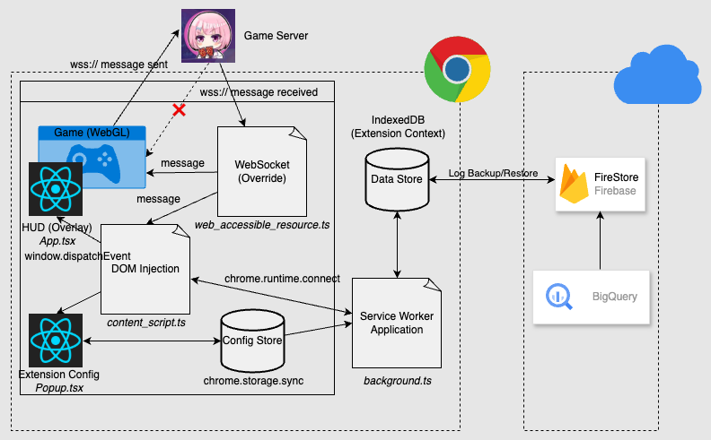

# PokerChase HUD

An unofficial Chrome extension providing real-time poker statistics and hand history tracking.


> **Note**: This codebase was primarily written by [Claude Code](https://claude.ai/code), demonstrating AI-assisted software development capabilities.

## Disclaimer

This is an **unofficial** Chrome extension not affiliated with PokerChase. Use at your own risk. The developers assume no responsibility or liability for any consequences arising from the use of this tool.

## Features

- **Real-time HUD**: Player statistics overlay with 13+ poker metrics
- **Hand History**: Live PokerStars-format hand log with export
- **Flexible Filtering**: Game type and hand count filters
- **Drag & Drop UI**: Customizable HUD positioning
- **Data Export**: JSON and PokerStars formats

## Quick Start

### Prerequisites

- Node.js 16+
- Google Chrome

### Installation

```bash
git clone https://github.com/solavrc/pokerchase-hud.git
cd pokerchase-hud
npm install
npm run build
```

### Load Extension

1. Open `chrome://extensions/`
2. Enable "Developer mode"
3. Click "Load unpacked" and select the project folder
4. Visit supported poker sites to see the HUD

### Development Workflow

```bash
npm run build         # Rebuild after changes
npm run typecheck     # Type checking
npm run test          # Run tests
```

After building, reload the extension in Chrome's extension management page.

## Architecture



## Documentation

📖 **[Technical Documentation](CLAUDE.md)** - Complete technical reference including:

- Architecture overview and design principles
- Stream processing pipeline details
- Database schema and API reference
- Development guidelines and best practices
- Troubleshooting guide

## Contributing

Contributions are welcome! The codebase uses a modular architecture for easy extension.

### Adding New Statistics

PokerChase HUD uses a modular statistics system. Quick overview:

1. **Create module** in `src/stats/core/[stat-name].ts`
2. **Implement `StatDefinition`** interface
3. **Export** from `src/stats/core/index.ts`
4. **Add tests** and verify functionality

**Example:**

```typescript
export const myStatistic: StatDefinition = {
  id: "myStat",
  name: "MS",
  description: "My Statistic %",
  category: "postflop",
  precision: 1,
  calculate: (actions, playerId) => {
    // Implementation here
    return [count, opportunities];
  },
};
```

📖 **[Complete Contributing Guide](CLAUDE.md#development-guide)** - See technical documentation for:

- Detailed implementation examples
- Code standards and security guidelines
- Testing procedures
- Pull request requirements

### Development Commands

```bash
npm run build         # Production build
npm run typecheck     # Type checking
npm run test          # Run Jest tests
npm run postbuild     # Package extension
```

### Project Structure

```
src/
├── components/       # React UI components
├── stats/           # Modular statistics system
├── types/           # TypeScript definitions
├── utils/           # Helper utilities
└── streams/         # Data processing pipeline
```
